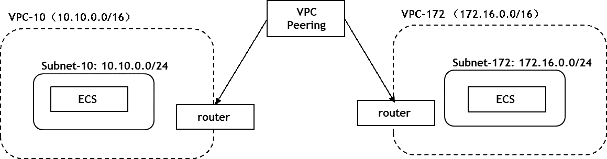

# VPC Peering
This example will create two VPC inside one tenant, then create a peering to enable the connection betweem them with VPC Peering

User guide: https://www.terraform.io/docs/providers/opentelekomcloud/r/vpc_v1.html

## Design
1. Create two VPC with network module
2. Create VPC peering with connect module
3. Create ECS instance with instance module

## Architecture

## Introduction

## Limitation

